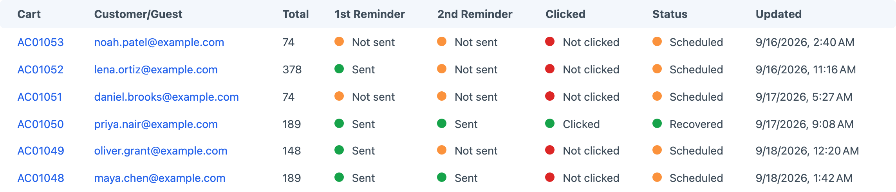
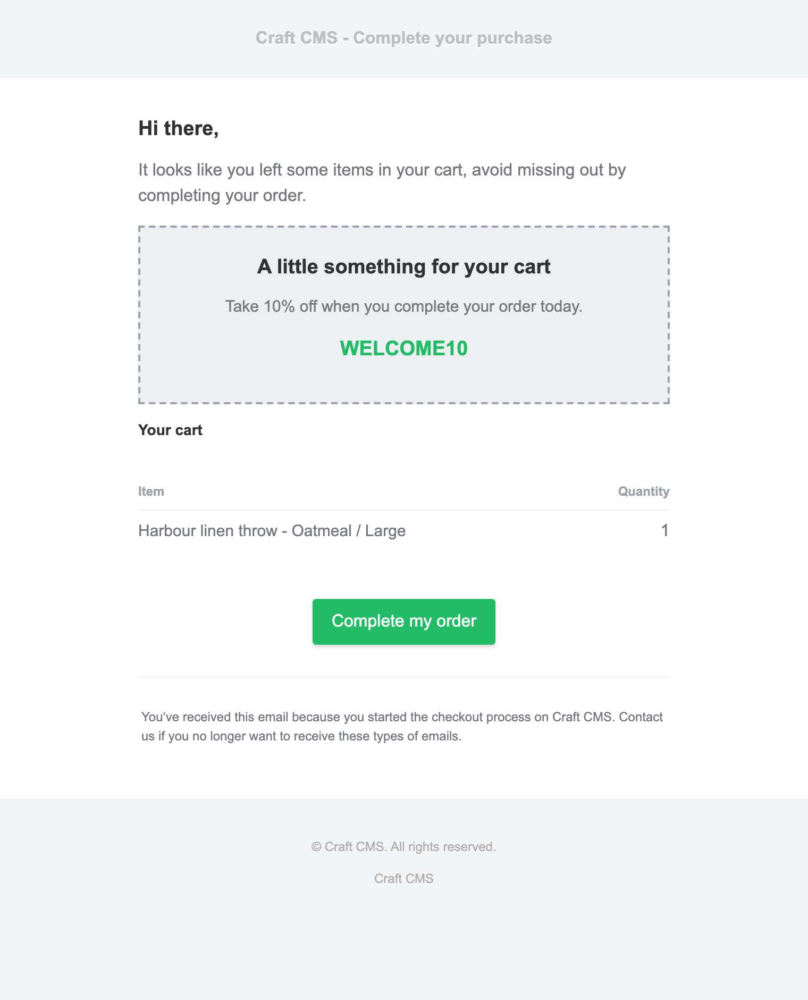

# Usage
Abandoned Carts will send a maximum of two emails, these emails can be configured to be sent after a certain amount of hours.

A responsive email template is included but can be overwritten with your own if preferred.

The email the customer receives includes a link that restores their cart. The plugin also uses this to detect clicks. The recorded click helps you distinguish a sent reminder from one the customer followed.



Discounts can also be included in emails. Create a discount code in Craft Commerce and enter that code in
Abandoned Carts settings.

All abandoned cart emails are created as jobs and placed in Craft's queue.

## Abandoned Logic
Commerce's active-cart duration determines when a cart becomes eligible; its default is one hour without activity. Abandoned Carts looks for incomplete, non-empty carts with an email address and a positive total in the 24-hour window preceding that cutoff. The configured blacklist and previous-order requirement can exclude otherwise eligible customers.

The first reminder delay starts when the scheduler picks up the cart. For example, with a one-hour active-cart duration, a one-hour first reminder delay and a scheduler running every five minutes, expect the first email roughly two hours after the last cart update, plus scheduling and queue processing time. The second reminder is scheduled on a later pass after the first reminder has run, using its own delay. It is not measured from the original cart update.

## Setup
The first step is to monitor carts when they turn into an abandoned state, and alert the owner of that cart about it.

Use the console command from a cron job where possible. An authenticated HTTP trigger is also available when the command line is not practical.

### Cron Job
Use a Cron Job to automate abandoned-cart detection from the command line.

```shell
*/5 * * * * /path/to/php /path/to/project/craft abandoned-cart/reminders/schedule-emails
```
Replace both paths with the PHP executable and `craft` file for your installation. Scheduling reminders and running Craft's queue are separate jobs; configure both on your server.

### HTTP Trigger
If the scheduler must be invoked over HTTP, send a POST request with the configured pass key in the `Authorization` header. Replace `example.com` with your site’s domain and `YOUR_PASS_KEY` with the configured pass key. If your installation uses a different action URL prefix, use that prefix in place of `/actions`.

```shell
curl --fail --request POST \
  --header "Authorization: Bearer YOUR_PASS_KEY" \
  https://example.com/actions/abandoned-cart/carts/find-carts
```

The endpoint does not accept the pass key in the URL or request body. If an earlier configuration used `?passkey=`, rotate that pass key after upgrading because it may remain in logs or browser history.

When the scheduler runs, eligible carts are scheduled as delayed jobs. Craft must also process its queue for the emails to be sent.

## Test a Reminder and Recovery

On a test installation, add a purchasable item to a cart and enter an email address you can read during checkout. Leave the order incomplete and stop changing the cart. Check your reminder settings, email templates and `recoveryUrl` first; the recovery destination should be your actual cart page.



Allow the active-cart duration to pass, run the scheduler and inspect Craft's queue for the delayed reminder. Wait for its delay and process the queue. Open the received email and follow its recovery link before `restoreExpiryHours` elapses. The destination should show the same cart items. If you configured a discount, check that Commerce accepts it for this cart rather than assuming that including a code makes the order eligible.

If no reminder is scheduled, confirm that the cart has an email, line items and a positive total, remains incomplete, and is not excluded by the plugin settings. If the job exists but no email arrives, inspect the failed job and Craft's email settings. Test the second reminder separately if it is enabled.
