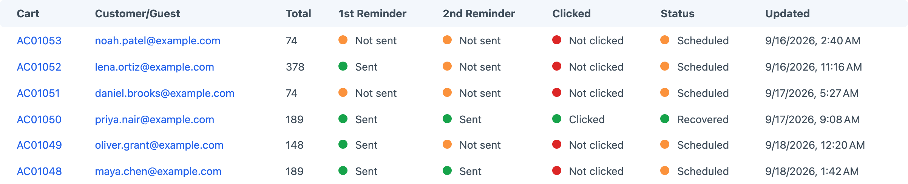
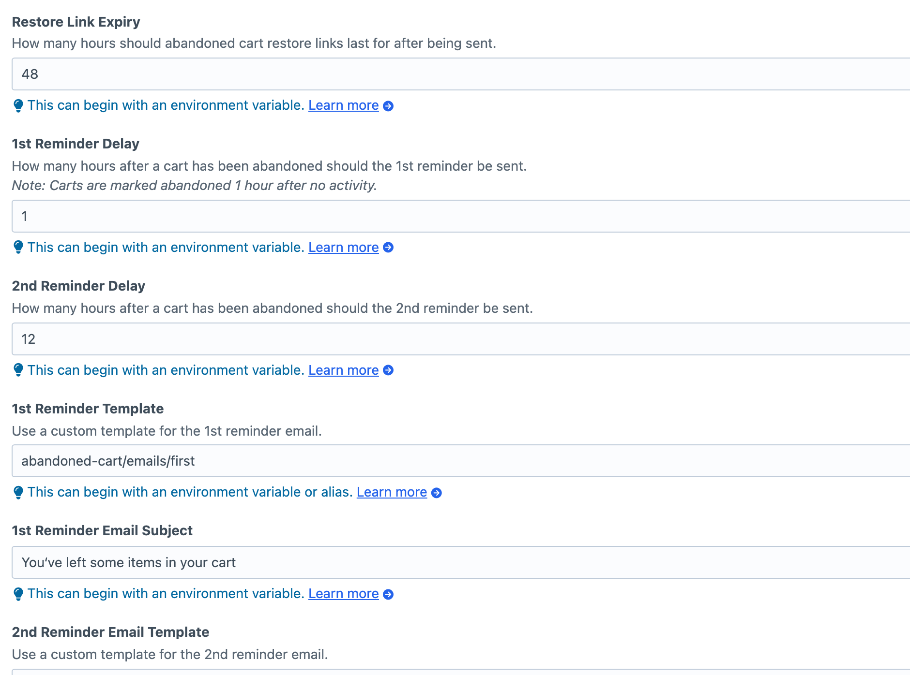
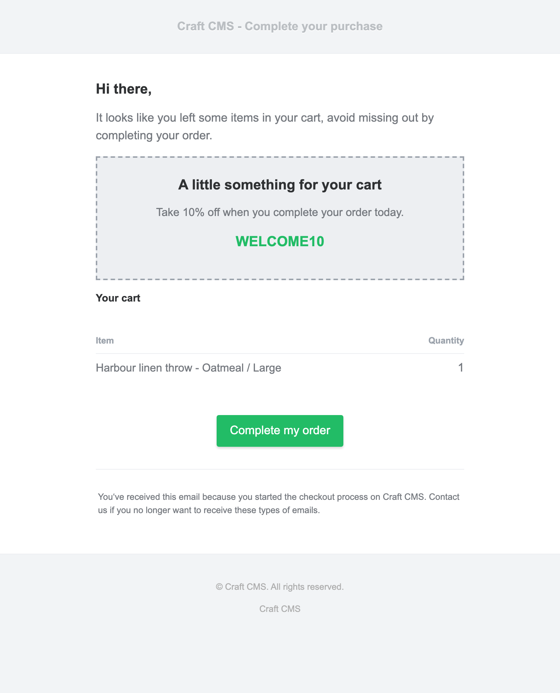

<!-- feature-intro -->
Abandoned Cart helps Craft Commerce stores recover lost sales with timely, branded email reminders. Bring customers back to the cart they left behind, control who receives each campaign, and see when recovery links are used.
<!-- feature-intro-end -->

<!-- feature-section media-size="large" -->
## Recover abandoned carts

Each reminder can include a secure restoration link that rebuilds the customer's cart. Customers return to the checkout flow they already started instead of having to find and add every product again.

Optional expiry settings keep old restoration links from remaining valid indefinitely.

<!-- feature-section-end -->

<!-- feature-section media-size="large" -->
## Schedule reminders

Choose when the first reminder is sent and add a second follow-up when it suits your store. Abandoned Cart uses Craft's queue, so reminder delivery fits into the same reliable background-processing workflow as the rest of your site.

Scheduled checks can run from a cron command or a secured web request, making the plugin suitable for different hosting setups.

<!-- feature-section-end -->

<!-- feature-section media-size="medium" -->
## On-brand emails

Responsive email templates are included to get you started, but the subject lines, templates and recovery destination remain under your control. Keep every message focused on the products the customer left behind.

<!-- feature-section-end -->

<!-- feature-grid -->
- :icon[layout-dashboard] **Cart activity** Search, sort and review abandoned carts from the Craft control panel.
- :icon[click] **Click tracking** See when a customer follows a recovery link, even before an order is completed.
- :icon[user-search] **Customer targeting** Require a previous order, include or exclude guests, and blacklist individual addresses or entire domains.
- :icon[discount] **Flexible discounts** Attach a Craft Commerce discount to a reminder campaign when you want to offer an incentive.
- :icon[code] **Developer hooks** Extend the recovery flow with plugin events and configuration settings documented for custom builds.
<!-- feature-grid-end -->
